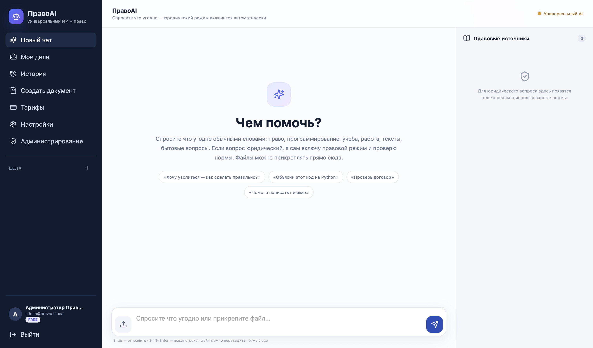

# ПравоAI

**ПравоAI** — локальный AI-ассистент с поддержкой юридических запросов и RAG-поиска по правовым источникам.

Система автоматически определяет юридические вопросы, подключает поиск по базе нормативных документов и формирует ответ с указанием использованных источников. Для обычных запросов работает как универсальный AI-чат.



## Возможности

- универсальный AI-чат;
- автоматическое определение юридических запросов;
- RAG-поиск по правовым документам;
- отображение использованных правовых источников;
- загрузка файлов в чат;
- создание документов;
- работа с пользовательскими делами;
- история диалогов;
- авторизация пользователей;
- административная панель;
- локальная работа LLM через Ollama.

## Технологии

- **Backend:** Python, FastAPI, SQLAlchemy, Alembic
- **Frontend:** React, TypeScript, Vite
- **Database:** PostgreSQL, pgvector
- **Cache:** Redis
- **AI:** Ollama, Qwen
- **Infrastructure:** Docker, Docker Compose

## Преимущества

- локальная обработка запросов без обязательного использования внешних AI API;
- использование RAG для работы с правовой базой;
- автоматическое переключение между обычным и юридическим режимом;
- разделение приложения на frontend, backend, AI и слой хранения данных;
- контейнеризированный запуск через Docker.

## Запуск

Для запуска необходимы **Docker Desktop** и **Ollama**.

```bash
git clone <URL_РЕПОЗИТОРИЯ>
cd pravoai_universal_edition_v6_1
chmod +x *.command *.sh ops/*.sh
./start.command
